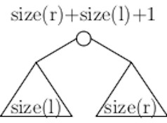

## Implementation of Binary Tree (contd)

The readers may be curious to know the reasons for continuing  an extended discussion on binary trees. From the perspective of 
implementation, plain binary trees are pretty helpful in understanding the power of recursion. However, different types of binary trees are used in 
building database indexes for efficient search and retrieval. We plan to deal with binary search trees and balanced binary
search trees in the future. Therefore, we start with the search for an element in a binary tree. 

The search function also works recursively. It starts with the root node and
recursively explores left and right subtrees. If the element is found in 
the left subtree, we do not need to continue the search in the right subtree. 
It means if the tree is more or less balanced, then the search operation can be 
completed in O(<i>log n</i>) time, where <i>n</i> is the number of nodes in 
the tree. The search function returns a pointer to the node if the element
is found; otherwise, it returns NULL. 
```
TREENODE * search(TREENODE * t, int x) { 
    TREENODE *p ;
    if ((t == NULL) || ( t->info == x))
       return t ;
    p = search(t->left, x);
    if (p == NULL) 
        p = search(t->right, x) ;
    return p;
}
```

Any computation involving a binary tree is easy to implement in recursively. As we have observed in the implementations discussed, a tree structure naturally 
yields to a divide and conquer process. We deal with two more instances. One computes the size of the tree, and the other computes the height of the tree. 
We can recursively find:
<ol>
   <li>The number of nodes in the left subtree</li>
   <li>The number of nodes in the right subtree</li>
</ol>
The computation process works as indicated in the diagrams below:


    
      
    

    
The size of the tree is equal to one more than the sum of the two numbersstated above. C-function for computing sum is given below:
```
int treeSize(TREENODE *t) {
    int size;
    if (t == NULL) 
        return 0;
    else {
        size = 1 + treeSize(t->left) + treeSize(t->right);
        return size;
    }
}
```

Likewise, the height can also be computed by adding one to the maximum of heights of the right and left subtree. 
```
int treeHeight(TREENODE *t) {
   int rHeight, lHeight;
   int maxHeight = -1;
   if(t == NULL) {
     return -1; 
   } else {
      lHeight = treeHeight(t->left); 
      rHeight = treeHeight(t->right);
      if (rHeight > lHeight) {
          if (maxHeight < rHeight)
              maxHeight = rHeight; 
      } else {
          if (maxHeight < lHeight)
              maxHeight = lHeight; 
     }
     return maxHeight+1;
    }
}
```
We define the tree with one node as having 0 height. Therefore, <i>maxHeight</i>
is initialized to -1. Adding 1 to -1 will give 0 if the tree consists of 
just the root node. 

The full source code for different operations on binary trees as discussed in
the blog is available [here](../CODES/BinaryTree/index.md). 

We plan to discuss a few applications of binary trees in the next blog.

[Back to Index](../index.md)
